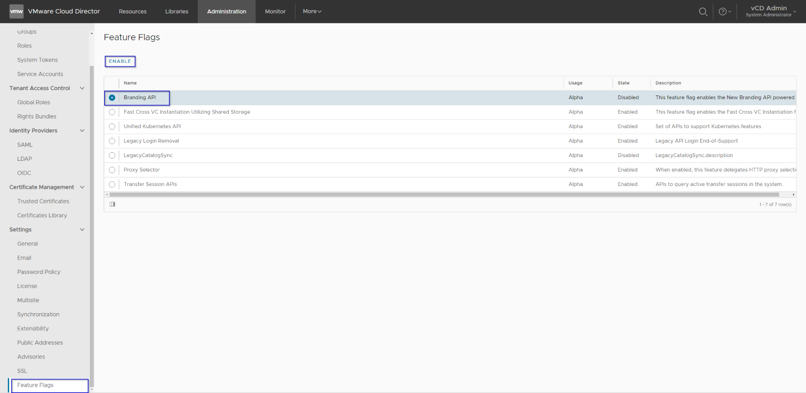
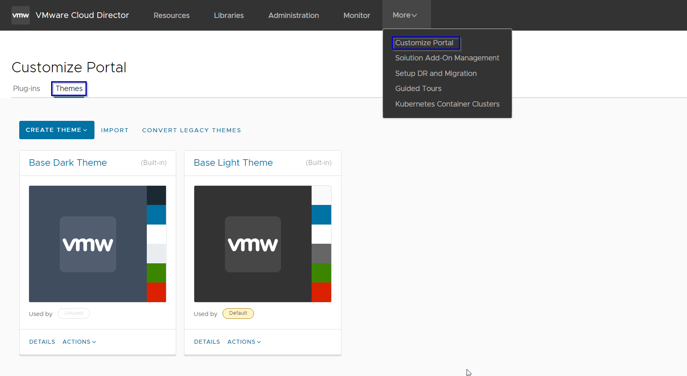
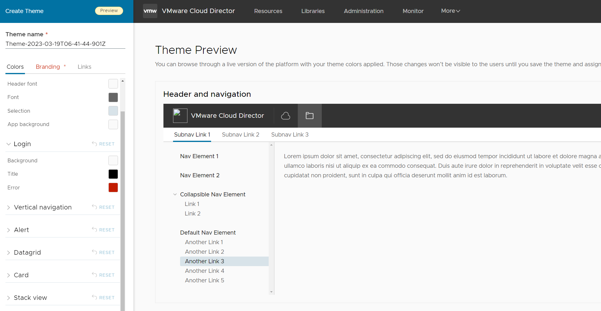
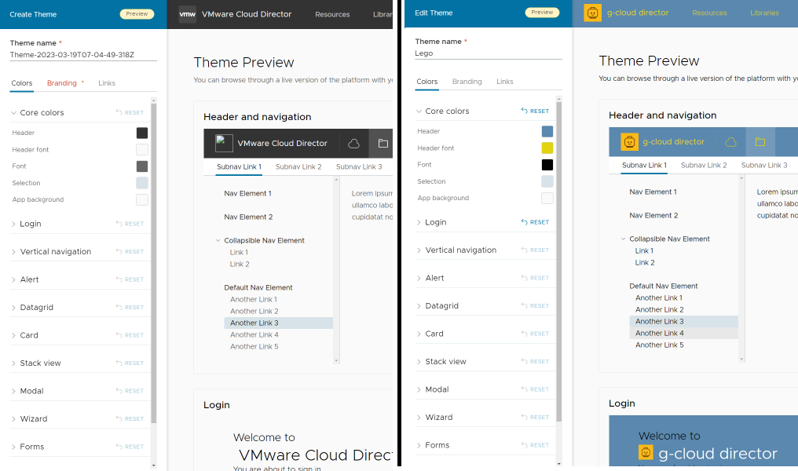
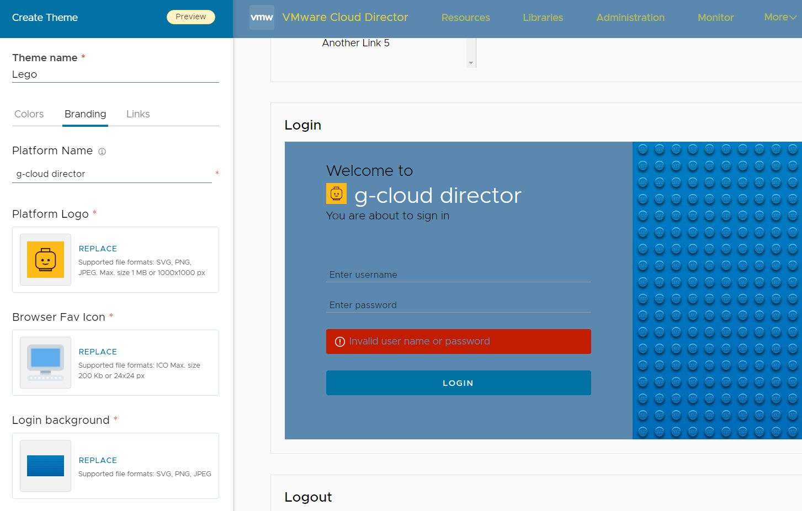
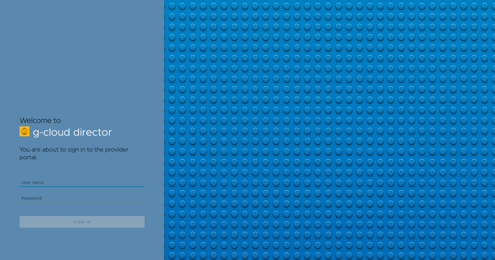

## Introduction

In previous releases of Cloud Director you needed to connect via API tools like Postman to modify branding and customisation capabilites. Now VMware have added UI functionality with many more color options and and the ability to upload pictures!

Here are the capabilities in the new Branding UI
<ul>
<li>Changing colours</li>
<li>Changing Images</li>
<li>Adding additional menus and editing existing menu links</li>
</ul>

<br>

-------------

## Enabling the Feature

-------------

The first thing to do is to enable the Branding API feature flag under Administration >> Feature Flags in the Provider Portal. Once enabled, you will receive the message 'Feature Branding API has been enabled', and you'll be good to go.





There is now a Themes section under More >> Customize Portal, which is accessible. You may be prompted to reload the page, but once that is done, this page gives you the ability to manage and administer your themes.

VCD Administrators are able to:
<ul>
<li>Create new themes</li>
<li>Edit existing themes</li>
<li>Clone themes</li>
<li>Assign themes to the provider and/or all tenants or individual tenants</li>
<li>Import/export themes, which can be useful for maintaining consistency in a VCD multi-site environment</li>
<li>Convert old legacy themes to be compatible with the new UI</li>
</ul>




For Tenants to see the login and logout pages, the following command needs to be run on the VCD Cells

```text 
./cell-management-tool manage-config -n backend.branding.requireAuthForBranding -v false 
```


<br>

--------

## Creating a New Theme

--------

When you click on Create Theme, you will be presented with two options: a light-based theme or a dark-based theme. Once you have selected a theme type and created it, you can give it a name! Additionally, the theme editor has three sections on the left-hand side that allow you to customize various aspects of the theme: Colors, Branding, and Links.  On the right you have a preview pane which shows your changes in real time.



-------------
###  Colors
-------------
On the colors page you can change the colour of everything, from Alerts, Banners, Boxes, Datagrids, Forms, etc.  I dont really have a knack for design so in this example below I've made the following changes:

<ul>
<li>Changed the Header to #5a88ae</li>
<li>Changed the Header font colour to #e1d30e</li>
<li>Changed the Login Background to #5a88ae</li>
<li>Changed the login title to #ffffff</li>
</ul




-------------
### Branding
-------------
In the Branding section you can give your Cloud Director instance name,  you can type whatever you want or you can add the variable ${TENANT_NAME}, that will populate the Tenant Organisation Name on the main header. 

You also need to upload a Platform Logo, Browser Fav Icon and a Login Background, these are the only compulsery fields in the theme editor.



-------------
### Links
-------------

With Links you can customise your Cloud Director Portal with links to various resources. 

<ul>
<li>Override the Help, About and VMRC links with your own documentation
<li>Add new Menu items if you have further information or products your customers are consuming.
<li>Add links to log in and log out pages e.g a "Having trouble loggin in?" link that can take you to a contact us page.
</ul>

<br>

-------------

## Final Thoughts
-------------

With the new 10.4.1 release, Cloud Director has come a long way with it's branding capabilities. Cloud Director can be the face of some products for Cloud Service Providers so its great to provide a custom solution!

I'd love to see other themes if anyone else has had a go at this so please get in touch and share.

<br>

-------------

## The Finished Product

-------------




