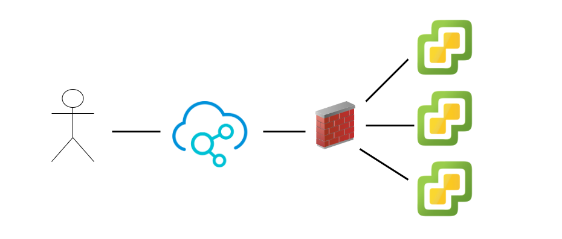

--------
## Introduction
--------
Cloud Director Centralized Point of Management (CPoM) is a UI Plugin that empowers providers to provide customers dedicated vCenter instances. Cloud Director can also act as a proxy which allows providers to simplify tasks such as setting up VPNs and navigating complex NAT configurations. Cloud Director can also act as an API endpoint for all your vcenters, which could simplify automation.

This blog article will run through the installation and configuration of CPoM 

<ul>
<li>Cloud Director can access the vCenter server via HTTPS</li>
<li>System Administrator role in VCD Provider Portal</li>
<li>Login account to the vCenter resource</li>

This steps we are going to take here are:
<ul>
<li>Enable the CPoM feature</li>
<li>Add dedicated vCenter as cloud resource</li>
<li>Publish resource to Tenant</li>
<li>Configure proxy settings</li>
</ul>

----------
## Enabling the CPoM Feature
----------
CPoM can be enabled in the Provider Portal under More >> Customize Portal, select 'CPOM extension' and click <strong>Enable</strong>

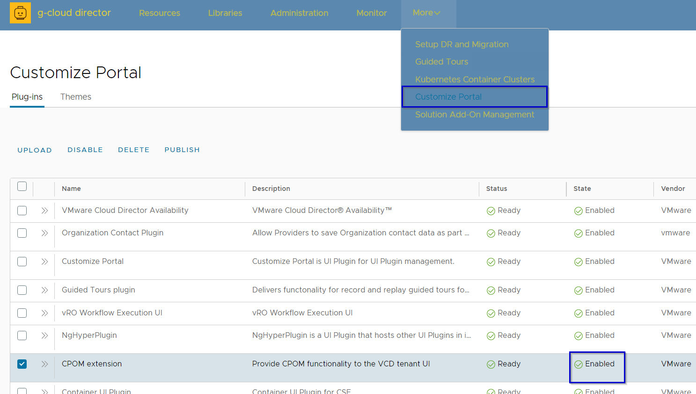

The CPoM feature will also need to be publised to tenants, while the CPOM extension is still selected click <b>Publish</b> and choose your tenants

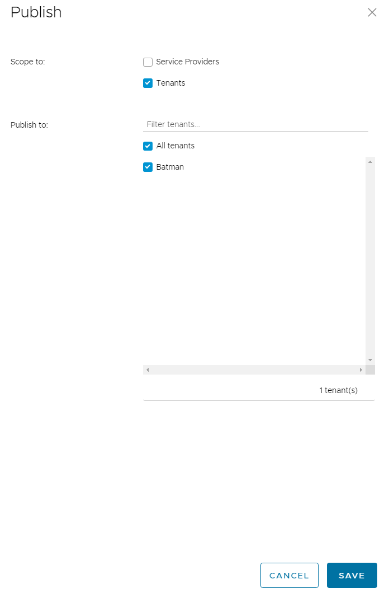

----------
## Add Dedicated vCenter as Cloud Resource
----------

Next is to add the vCenter server as a Cloud Resource. Click on Resources >> vCenter Server Instances >> Infrastructure Resources >> ADD.
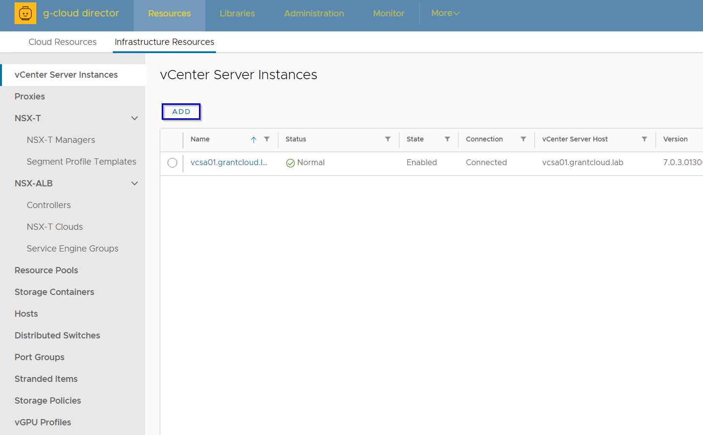

----------
### vCenter Server
----------
The Add vCenter Wizard opens and you will be prompted for the following:

<ul>
<li><b>Name:</b>  Unique name to identify vCenter instance</li>
<li><b>Description:</b> Optional description field</li>
<li><b>URL:</b> https:// url of vCenter server</li>
<li><b>Username:</b> Username/Password to authenticate with vCenter</li>
<li><b>Password:</b> Username/Password to authenticate with vCenter</li>
<li><b>Enabled:</b> If enabled you will be ready to publish this vCenter to a Tenant.</li>
</ul>

**The below screen shot uses the <b>administrator@ vsphere.local</b> username to authenticate with the vCenter Server,  I couldnt find any offical documentation on this but I tested an account with a <b>Read Only</b> Global Permission role and that also worked fine.**

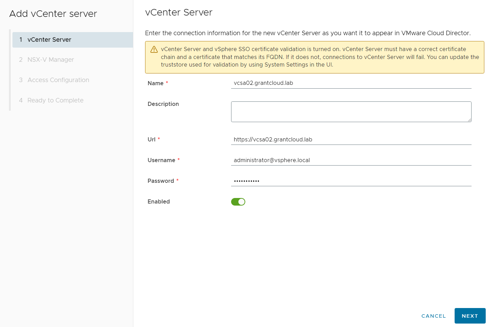

Once you filled that out Click <b>Next</b>.  Youll get a prompt to retreive and trust the vCenter certificate

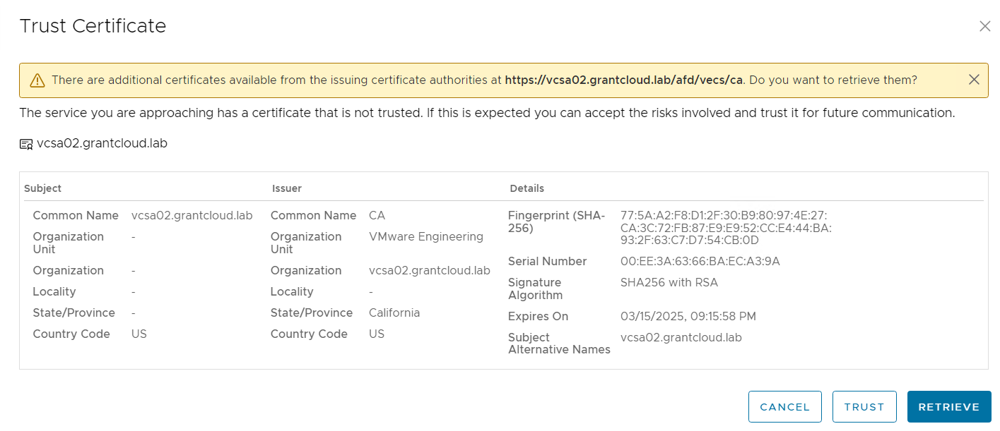

----------
### NSX-V Manager
----------

I am going to disable NSX-V Manager by clicking on the <b>Configure Settings</b> slider.  NSX-V is being replaced by NSX-T. 

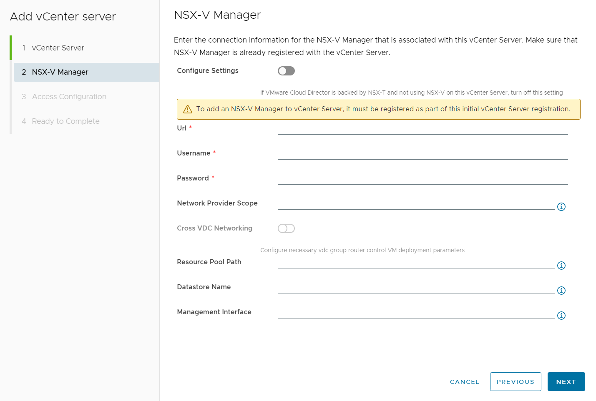

Click <b>Next</b>

----------
### Access Configuration
----------

Now this is where you actually define this as a dedicated vCenter rather than a shared vCenter resource for orgVDCs. This is done by selecting <b>Enable Tenant Access</b>.  We are also going to enable <b>Generate Proxies</b> so we can walk through that as well. 

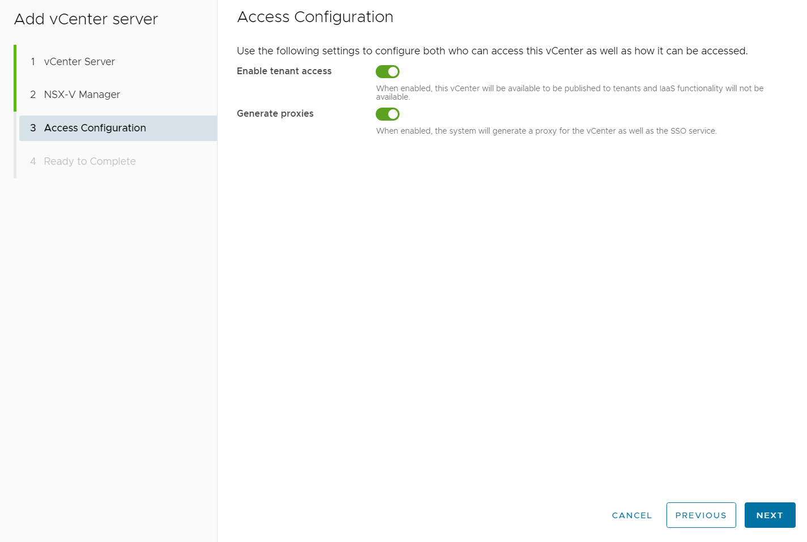

Click <b>Next</b>

----------
### Ready to Complete
----------

Ready to complete is an overview on what we have done so far,  review your settings and then click <b>Finish</b>

I did get prompted to trust the vCenter certificate again.
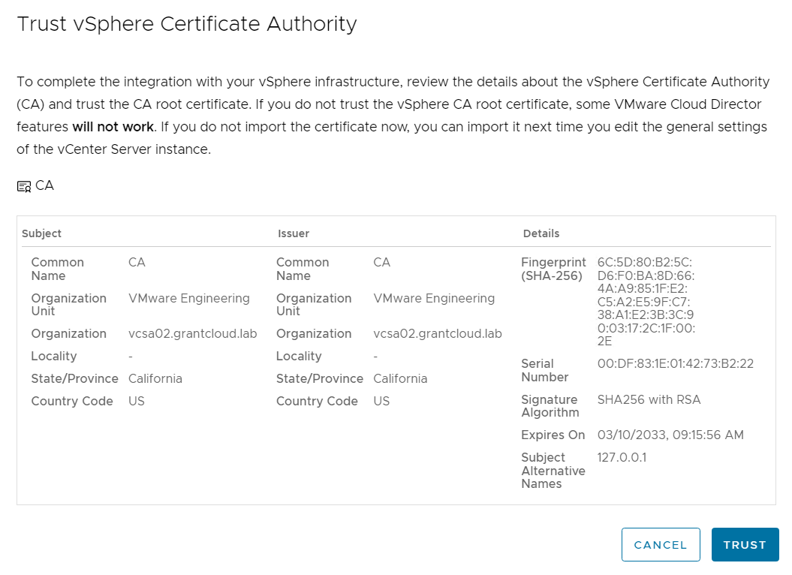

You should see the new vCenter now. In the screen shot below I have 2 vCenters with different usage fields, vcsa01 has a usage class of IaaS this is for my tradational orgVDC backed shared compute environment and the vCenter vcsa02 has a usage class of SDDC (Software Defined Data Center) 

----------
## Publish to Tenant
----------

Now to publish this Dedicated Resource to a Tenant, select the SDDC vCenter and click <b>Manage Tenants</b>

Select your Tenant and click <b>Save</b>

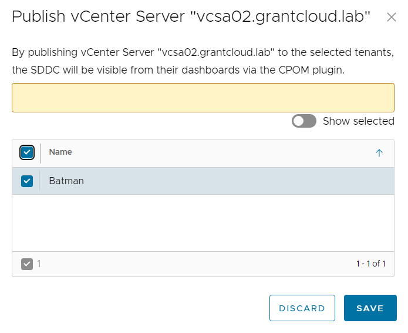

----------
## Proxy Configuration
----------

When we added the vCenter server, we enabled the Generate Proxies setting which created a proxy for us.  This can be view by clicking on the vCenter server and then Proxies on the sidebar.  Here you can also generate new proxies for NSX Managers, ESXi Hosts UI and SSO is there in case there is an external PSC. 

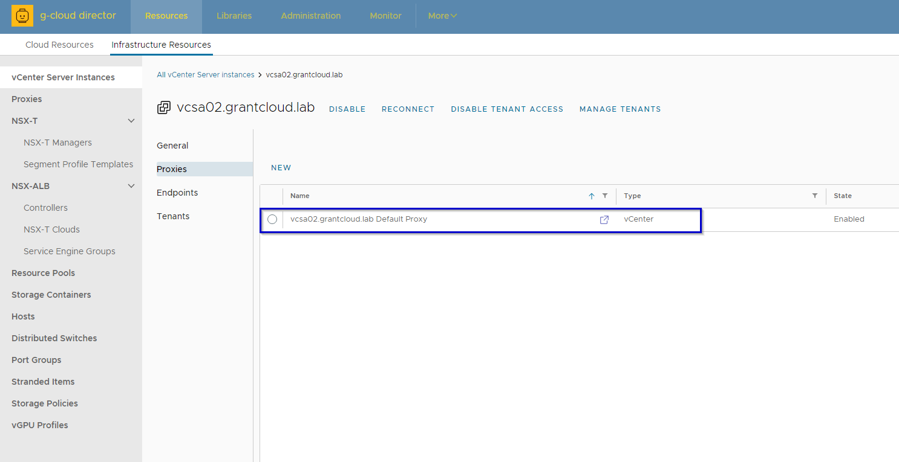

----------
## Extra Configuration
----------

For Tenants to see this new dedicated vSphere instance you'll need to confirm the following, the first 2 have already been done in this exercise.

<ul>
<li>The CPOM Plugin has been published to the tenant.</li>
<li>The vCenter server has been published to the tenant.</li>
<li>Modify rights bundles and tenant roles to access the SDDC Resource</li>
</ul>

 

----------
## Tenant Portal
----------

Lets log into the Tenant Portal, browse to Data Centers >> Dedicated vSphere Data Centers. 

And you should see the new SDDC ready to go!

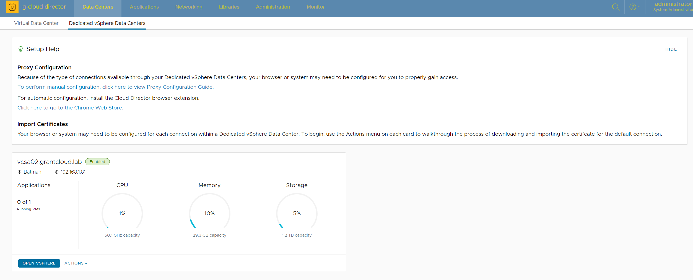 

----------
### Tenant Portal Proxy Configuration
----------
You may need to action a few steps to configure the proxy capabilities, either by downloading a chrome extension or updating your Windows OS Internet LAN Settings with a automatic configuration script.  When you click <b>Actions</b> under your SDDC Instance and click <b>Username and Password</b> you will get the Proxy credentials needed.

 

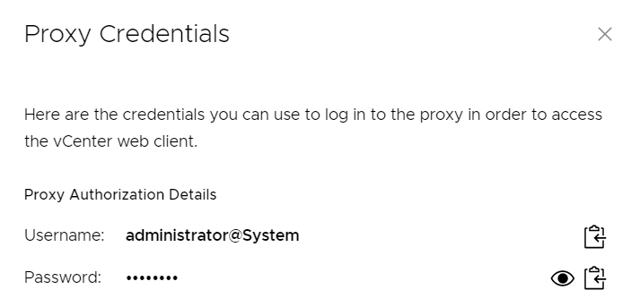 

----------
## Conclusion
----------

And there you have it! Customers can have all their dedicated resources in the one UI with a quick glance of capacity requirements and total number of VMs. 

 

